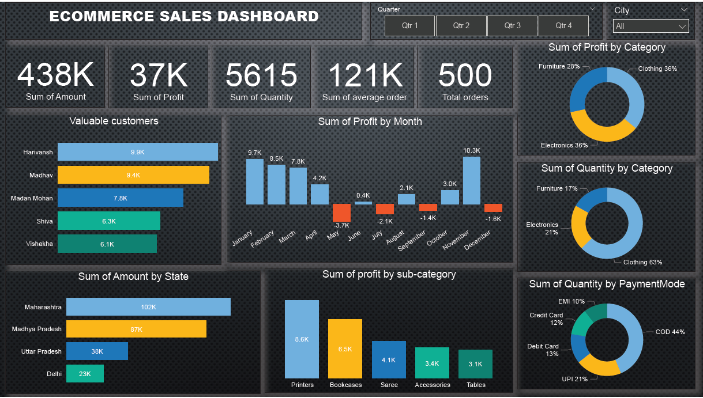

# [Project 1 : ECOMMERCE SALE DASHBOARD]

 * Created interactive dashboard to track and analyze online sales data using POWER BI.
 * Used drill down in worksheet and customization using filters and slicers.
 * Created connection , join new tables, calculation to manipulates data and enable user driven parameter for visualization.
 * Used different types of customized visualization (bar chart, pie chart, donut chart, line chart, slicer)
 
