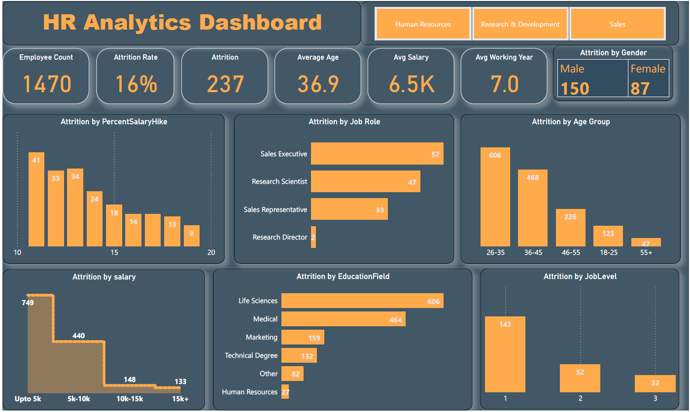

# [Project 1 : ECOMMERCE SALE DASHBOARD]

 * Created interactive dashboard to track and analyze online sales data using POWER BI.
 * Used drill down in worksheet and customization using filters and slicers.
 * Created connection , join new tables, calculation to manipulates data and enable user driven parameter for visualization.
 * Used different types of customized visualization (bar chart, pie chart, donut chart, line chart, slicer)
 
 
 

# [Project 2 : MUSIC STORE DATA ANALYSIS]

* Utilized MY SQL to extract data from 10 different related tables from music sales databases using JOIN 
* Transformed and filtered data by using aggregating and filtering function.
* Loaded and visualized data with Power bi to identify key business intelligences that uncovers trends related to music genre popularity and customer spending.

